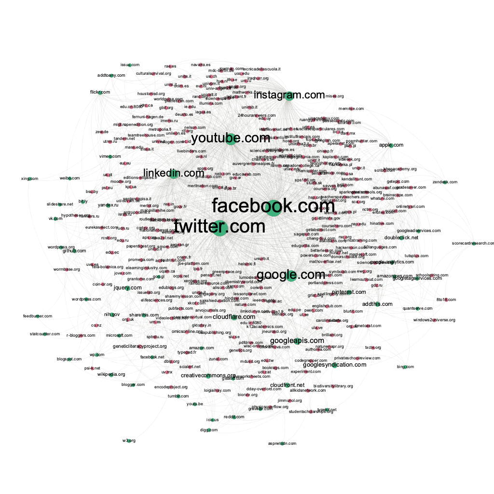

## 摘要

随着社交媒体和网络的发展，数字化监控技术已经渗透到我们生活的方方面面。数字化监控的不透明性会使得用户的隐私泄漏。社交网络中的数字化监控主要由web tracking技术为主导。我们将在本文中研究全球教育网站中的web tracking技术的发展。由于教育网站相比其他网站来说具有更高的更新频率，这可以帮助我们更好的分析web tracking的变化。所以在本文中，我们对教育网站中的trackers进行了定量分析和结构化的分析。我们使用*domain shared* 指标来衡量trackers的的tracking能力，并将其作为我们的rank measure 对所有的trackers 进行排序。除此之外，我们构建了教育网站和trackers之间的二部图来研究不同网站trackers的分布。最后，我们对教育网站中的trackers进行了回归分析。我们发现在教育网站中，教育网站中的trackers数量从2017年到2021年有逐年减少的趋势(大约19%)，不同trackers对网站的tracking能力变化较大，“Facebook”,"Twitter"这些社交媒体类型的trackers在教育网站中占据了统治地位，其中“Facebook”和“twitter”的domain share 为49% 和42%。

## 介绍

在2018年，纽约时代周刊披露了一个全球性的丑闻：Facebook收集普通用户的信息用来引导用户向Donald Trump 投票。而就在五年前，Edward Snowden也揭露了美国棱镜监控系统非法获取用户信息的丑闻。斯诺登事件和Facebook事件暴露了监控经济学的两个问题：

* 监控无处不在(ubiquity)，每一个都有一定的监控基础设施来进行数字化监控。
* 不透明性(intransparency)，对于被监控者来说，他们并不知道自己处于监控之中。

然而，研究监控主义是非常困难的，因为只有一些特殊的公司，一些有权利的组织才会具有收集数据的能力。[Common crawl](https://commoncrawl.org/) 项目为我们提供了分析这种数字化监控的可能。Common crawl 项目是一个开放的网络爬虫数据集，任何个人和组织都可以访问和使用这个数据集。从2008年以来，Common crawl 存储了PT级别的数据集，该数据集会按月更新。Common crawl存储了原始的网页数据集，抽取后的元数据集和文本数据供我们使用。Common crawl 项目存储在[Amazon](https://aws.amazon.com/cn/) S3中，我们开发了一套大数据处理框架帮助我们处理海量数据。在后续中我们将对此进行详细介绍。数据集收集完成后格式如下：

```
domain, trackers_list

bulbapp.com,"google.com,facebook.com,doubleclick.net,googleadservices.com,cloudfront.net,typekit.net"
```

数据格式为“education domain,tracker list”, tracker list 用逗号进行分隔。

在本文中，我们选择了教育网站作为分析web tracking技术的对象。因为教育网站相比其他网站更新频率较高，可以帮助我们研究tracking技术的发展变化。通过对教育网站domain中trackers的分析，我们发现从2017年到2021年，教育网站的trackers数量呈现缓慢减少的趋势。可能原因是教育网站中涉及到更多的个人信息。为了防止web tracking技术对用户造成个人隐私的泄露，教育网站正逐步减少web tracking技术的使用。除此之外，我们对教育网站中trackers 的tracking能力进行了分析。结果表明，有的trackers会在大多数网站中 tracking, 有的trackers只会在很少部分的网站中出现。研究不同trackers 的tracking 能力可以帮助我们更好的分析教育网站中用户的信息丢失问题。从定量的分析上来看，教育网站中占主导地位的trackers是“Facebook.com”，“twitter.com”等，这些都是一些社会媒体类的trackers。另外，我们构建了website和domain的bipartite network。从网络中我们可以看出，“Facebook.com” 和 “twitter.com” 在所有的教育网站中占有主导地位。

我们对教育网站中的trackers进行了聚类分析。我们尝试K-means cluster算法进行回归分析，但是K-means算法不太适合这里的trackers数据。最终我们使用Louvain method进行community detection。对trackers的cluster分析可以帮助我们分析trackers在edu websites的分布使用情况。

我们的论文贡献如下：

* 通过研究教育网站中trackers从2017到2021年的定量变化，我们发现教育网站中的trackers正在逐渐的减少，这可能是由于教育网站中数字化监控所带来的个人隐私泄露正在受到重视。教育网站正在减少trackers的数量来减少对用户个人信息的tracking。
* 我们对教育网站不同trackers的tracking能力进行了定量和结构化的分析。对于定量分析，我们使用了domain share指标来刻画不同trackers的tracking能力。对于结构化分析，我们构建了website domain和trackers的bipartite third-party network。这可以帮助我们更加直观的看到不同trackers对于websites的tracking能力。
* 我们对教育网站中的trackers进行cluster analyze。Cluster analyse可以帮助我们了解trackers的分布和功能。从而让我们了解用户的隐私泄露问题。
* 我们开发了一套大数据处理框架，它可以帮助我们处理海量数据集。同时，它具有很高的可扩展性，便于之后的研究者进行相关的研究工作。所有的代码已经开源：

## Online Tracking 基础

在这一节中，我们将对tracking的基础进行介绍。

* *Third-Parties* 

  当用户在网站上进行浏览或者检索等交互行为时，Online tracking就发生了。在网站的后台，就会有一个或者多个服务对用户的交互行为进行记录。这些第三方的服务我们就叫为*Third-Parties*。
* Trackers

  当这些third-parties 的目的是收集用户浏览的信息。或者这些third-parties所有者的公司商业模式是在收集用户信息，我们都可以把他们称为trackers。所以我们将广告服务和社交网络插件认为是trackers，因为他们都是在收集用户信息。而对于一些内容传递式的third-parties, 我们不认为他们是trackers了，因为他们的主要目的是为了加速网站的加载。

## 数据获取

在这一节中，我们将介绍数据收集的工作。

### Edu websites list

教育网站来自于Akrati

### Common crawl dataset

Common crawl dataset是一个开源网络爬虫数据集合。从2008年以来，common crawl数据集包含PT级别的数据。Common crawl 数据集是月级别更新的，目前已经更新到2021年6月份。数据集中保存的有原始的网页数据集，抽取的元数据以及文本数据。Common crawl 数据集存放在Amazon S3中。我们可以通过S3或者http来访问数据集合。以下是元数据warc的一个例子:

```tex
WARC/1.0
WARC-Type: response
WARC-Date: 2014-08-02T09:52:13Z
WARC-Record-ID: 
Content-Length: 43428
Content-Type: application/http; msgtype=response
WARC-Warcinfo-ID: 
WARC-Concurrent-To: 
WARC-IP-Address: 212.58.244.61
WARC-Target-URI: http://news.bbc.co.uk/2/hi/africa/3414345.stm
WARC-Payload-Digest: sha1:M63W6MNGFDWXDSLTHF7GWUPCJUH4JK3J
WARC-Block-Digest: sha1:YHKQUSBOS4CLYFEKQDVGJ457OAPD6IJO
WARC-Truncated: length

HTTP/1.1 200 OK
Server: Apache
Vary: X-CDN
Cache-Control: max-age=0
Content-Type: text/html
Date: Sat, 02 Aug 2014 09:52:13 GMT
Expires: Sat, 02 Aug 2014 09:52:13 GMT
Connection: close
Set-Cookie: BBC-UID=...; expires=Sun, 02-Aug-15 09:52:13 GMT; path=/; domain=bbc.co.uk;

<!doctype html public "-//W3C//DTD HTML 4.0 Transitional//EN" "http://www.w3.org/TR/REC-html40/loose.dtd">
<html>
<head>
<title>
	BBC NEWS | Africa | Namibia braces for Nujoma exit
</title>
...
```

#### Third-parties or trackers in common crawl

在上文中我们已经对网页中的trackers和third-parties进行了定义，接下来，我们需要从Common crawl 数据集中抽取出我们的trackers。在本文中，Website domain 和 trackers都是用Pay-level domain来标识。基于之前的研究工作，<https://ssc.io/trackingthetrackers/>, 我们将利用该论文中人工标注的third-parties。

| tracker domain        | registration_org | registration_country | category    |
| --------------------- | ---------------- | -------------------- | ----------- |
| google-analytics.com  | Google Inc.      | US                   | Analytics   |
| googlesyndication.com | Google Inc.      | US                   | Advertising |

比如上面的表格中，“google-analytics.com”就是trackers 的pay-level domain.

#### Parse html dataset

为了从Common Crawl原始数据集中抽取出trackers的pay-level domain, 我们需要从原始的HTML代码进行解析。如图所示，对于websites "http://techcrunch.com", 其网页中trackers主要嵌入在"iframe","javascript","img"等元素中。在本文中，我们使用“iframe”，“javascript”，“img”，"href"这四种元素对trackers的pay-level domain进行抽取。抽取HTML的脚本依赖于[BeautifulSoup](https://www.crummy.com/software/BeautifulSoup/bs4/doc/) 或者<https://github.com/rushter/selectolax> 

我们将抽取到的website和trackers构建bipartite trackers network。其中source是websites，target是trackers。


### Big Data Framework

尽管common crawl为用户为用户提供了很方便的下载途径，但是如果把数据下载到本地再进行分析显然不是很不方便的。就2021年6月一个月的数据集来说，单是warc数据集就有57TB。所以我们一个大数据框架来帮助我们处理海量common crawl数据集。常见的大数据处理框架有hadoop和spark。Common crawl project 为我们提供了几个简单的例子。<https://github.com/commoncrawl/cc-pyspark> ,在我们的工作中，我们将使用pyspark进行数据抽取工作。

另外，我们需要构建一个大数据集群。Amazon EMR 可以帮助我们快速的构建一个分布式大数据集群。而且Amazon EMR对Amazon S3 是可访问的，这样我就不必对common crawl数据集进行转移，这可以省去很多计算资源和存储资源。在本文中，我们将构建一个50个结点的分布式集群。每一个实例类型为Amazon实例中的m5.xlarge(4 vcore, 16GB)。

平台搭建完成之后，我们面对的首要问题就是如何在Common crawl数据集中找到Edu websites, 如果遍历所有数据去找我们需要的网站是非常耗时的。非常幸运的是，Csommon crawl已经为我们建立了数据集合的索引文件，我们可以根据索引找到对应网站的存储路径。同时，我们也可以根据索引找到websites的历史数据，这个过程就像“wayback machine”一样。在外面的框架中，我们利用Amazon Athena建立索引。我们通过SQL语句就可以检索出对应教育网站在common crawl dataset中的存储路径，我们将索引的结果存放在S3中以便我们后续访问。

整体框架如图所示：


## 相关工作

这里先不写T

## Global Analysis of Tracking Services

在本节中，我们将从数量上分析2017年到2021年教育网站中trackers数量变化。同时，我们将研究third-parties和网站中tracking services的分布情况, 这可以帮助我们了解不同trackers的tracking 能力。因为有的trackers可能在数百外的网站中出现，而有的可能只是在一些特定的网站中出现。通过分析教育网站的trackers分布，我们可以知道用户在访问教育网站时，哪些个人信息最有可能被tracking。另外，我们要注意到目前没有任何开放数据可以定量的给出教育网站的的访问数量。所以我们对PageRank进行排序，用PageRank的排序来反映网站的流量。

### Number of Trackers


从图中可以看出，在教育网站中，trackers的数量是在逐年减少的。这是一个有趣的现象，因为从直观上来说，随着web tracking技术的发展，trackers在全球范围网站的数量应该是增加的。而教育网站trackers数量减少的原因可能是由于教育网站对用户个人隐私泄漏问题的重视，教育网站相比其他网站具有更多的用户敏感信息，比如学历，职业等等。为了防止用户在与网站交互时个人的敏感信息泄漏，教育网站的trackers正在逐渐减少。

### Ranking Tracking Services

我们将定义一个third-parties 的ranking measure来帮助我们分析不同trakers对网站的的tracking能力。令$D$ 是我们要分析的网站集合。$t(D)$ 是一个子集合${d|d\in D \wedge t  \text{ embedded in d}}$​ ，表示具有third-parties的domain。我们定义了*domain share $d_{D,t}$* 

$d_{D,t}=\frac{|t(D)|}{|D|}$


上图是根据*domain share*对third-parties 进行的排序。从图中可以看出，具有统治地位的是"facebook.com" 和“twitter.com”, 其中facebook的domain share 是0.49，这说明这个trackers对49%的pay-level domain 进行了tracking。我们可以看到，“facebook”, "twitter"，“google”这些都是social media-related third-parties。接下来才是“google.com”。这说明对于教育网站来说，tracking 用户信息的主要来自于社交媒体，而不是google。因为教育网站的盈利性质不是那么明显，不像盈利性质的网站一样，需要tracking用户的消费行为，从而进行精准推荐，而这些往往会和google有关。

### Bipartite third-party network

为了更加直观的表现出trackers对网站的tracking能力。我们构建了bipartite third-party network。 如下图所示，绿色的结点为trackers，红色的结点是edu 网站。从图中可以看出，"facebook.com" 和“twitter.com” 在所有的trackers是具有统治力地位的。“facebook.com”, "twitter.com","youtube.com","google.com","linkedin.com","instagram.com" 这几个trackers对其他的trackers具有绝对的统治能力。其他的trackers只会tracking少数网站的信息。



### Cluster Analysis of Tracker Co-Occurrences

在本节中，我将对教育网站中使用的trackers进行cluster分析。首先，我们受到词向量技术的启发构建tracking 的共现矩阵。然后我们使用Louvain method 来对网络进行community detection。

#### Tracking Co-Occurrences

在本文中，我们将每一个教育网站看作是一篇文章。教育网站中的trackers可以看成是document中的词。首先我们需要构建trackers的字典，每一个tracker都会有一个对应的索引。


## 引用

1. On the Ubiquity of Web Tracking: Insights from a Billion-Page Web Crawl.