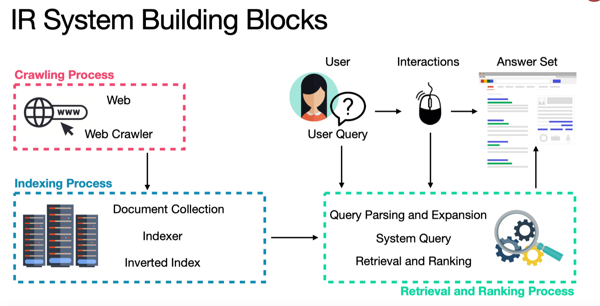
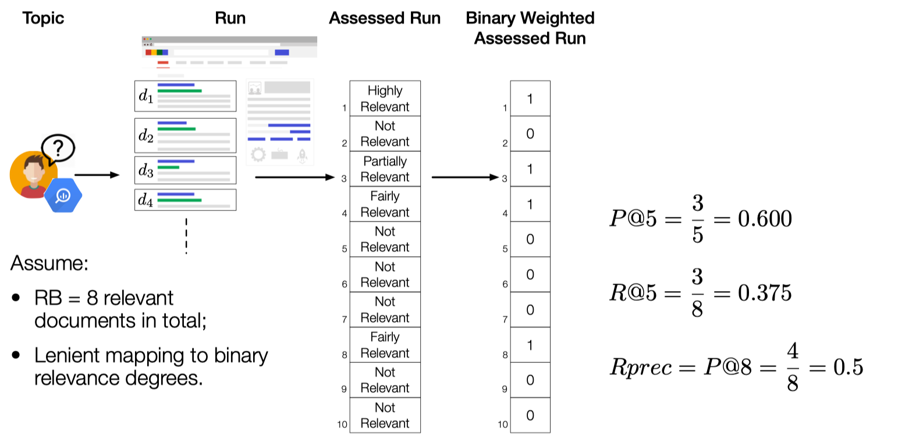
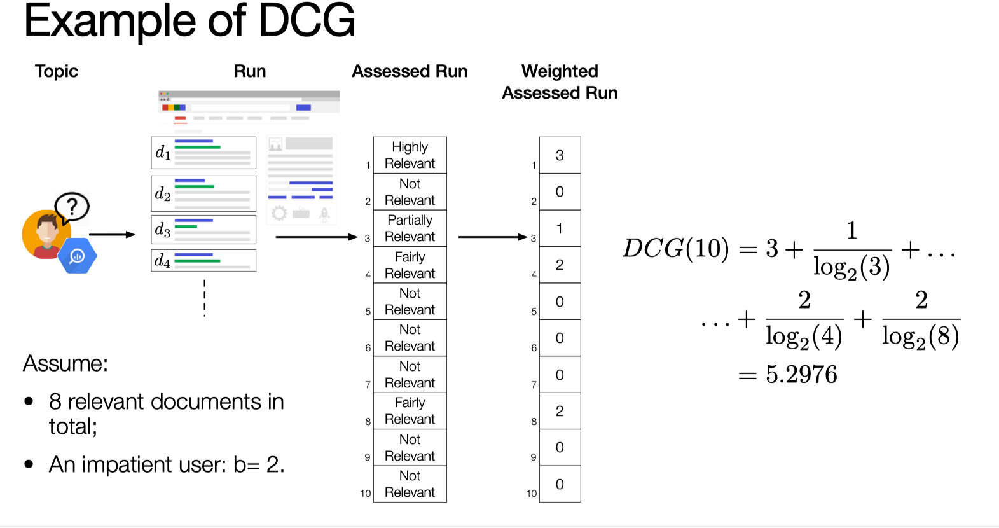

信息检索用来处理信息的表示，存储，组织结构以及信息的获取。这些信息包括文档，网页，半结构化的目录，多媒体对象。

## 介绍

信息检索在我们的生活中处处可见，最常见的有Web search Engine, 桌面系统，邮件检索系统等等。整个信息检索系统分成一下几个部分，

* Crawling Process

  这个过程一般不是由我们完成，需要爬虫帮我们完成。
* Indexing Processing

  这是信息检索系统中非常重要的一步，就是建立索引。这样我们可以快速的找到我们需要的文档，而不是一篇一篇的去遍历。
* 接下来就是用户和信息检索系统交互的过程，用户输入一个query，信息检索系统返回他要的结果。算法工程师的工作在这个阶段，他们需要构建模型让用户检索出来的结果是最优质的。



## 信息检索的评估策略

当信息检索系统被构建之后，我们需要去评估信息检索系统的好坏。我们将对一些常见的评估策略进行简单的介绍。

### Set Based Evaluation

* **Precision**

  检索的文档的确是相关的。

  $P=\frac{A\cap B}{B}$
* **Recall**

  相关的文档的确被检索的比率。

  $R = \frac{|A\cap B|}{A}​$
* F-measure F-measure 是Precision 和Recall 的调和平均数

  $F=\frac{2}{\frac{1}{P} + \frac{1}{R}} = 2\cdot \frac{P\cdot R}{P + R}$
* Precision@k

  $P@k = \frac{1}{k}\sum\limits_{n = 1}^kr_n$

  where $r_n\in{0,1}​$ is the relevance degree of the n-th document.
* Recall@k

  $R@k = \frac{1}{RB}\sum\limits_{n=1}^kr_n​$

  where RB is the recall base, i.e. the total number of relevant documents。
* Rprec

  $Rprec=P@RB​​$

  例如

  

## Rank-based Evaluation Measures

### Average Precision

$AP = \frac{1}{RB}\sum\limits_{k\in R}P@k$

where $R$ is the set of the rank positions of the relevant retrieved documents;

**Mean Average Precision(MAP)** is the mean of AP over a set of topics.

### Discounted Cumulated Gain

$\begin{equation}DCG(k) = \left{\begin{aligned} \sum_{n=1}^kr\_n \ DCG\_{k-1} + \frac{r_k}{\log\_b(k)} \end{aligned}\right. \end{equation}=\sum\limits\_{n = 1}^k\frac{r_n}{max(1,\log_b(n))}​​​$

where the base of the logarithm b indicates the patience of the user in scanning the result list.

* DCG 可以处理multi-graded relevance
* DCG does not depend on the recall base
* DCG is not bounded in \[0,1]



### Normalized DCG(NDCG)

To normalize DCG in \[0,1], you need to compute the ideal run。我们将最理想化的DCG作为分母进行normalized。

$NDCG(k) = \frac{DCG(k)}{iDCG(k)}$

## 用pyterrier进行信息检索

pyterrier 是一个很好的工具，可以帮助我们快速的熟悉信息检索系统。

### 获取数据

```
import pyterrier as pt
import pandas as pd 
pt.init()
pt.logging("INFO")

dataset = pt.datasets.get_dataset('irds:cord19/trec-covid')
```

### 建立索引

```
indexer = pt.index.IterDictIndexer('./cord19-index')
indexref = indexer.index(dataset.get_corpus_iter(), fields=('title', 'abstract'))
index = pt.IndexFactory.of(indexref)
# 输出最终的数据统计
print(index.getCollectionStatistics().toString())
```

### 建立索引模型进行实验

```
indexer = pt.index.IterDictIndexer('./cord19-index')
indexref = indexer.index(dataset.get_corpus_iter(), fields=('title', 'abstract'))
index = pt.IndexFactory.of(indexref)
# 输出最终的数据统计
print(index.getCollectionStatistics().toString())
```

非常的方便。