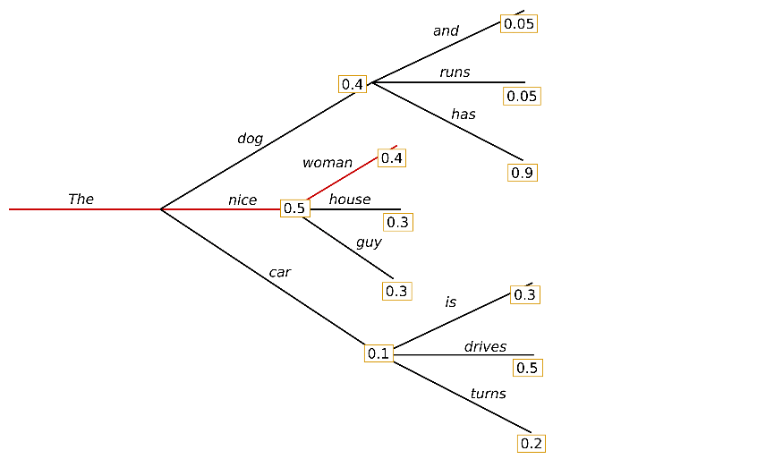
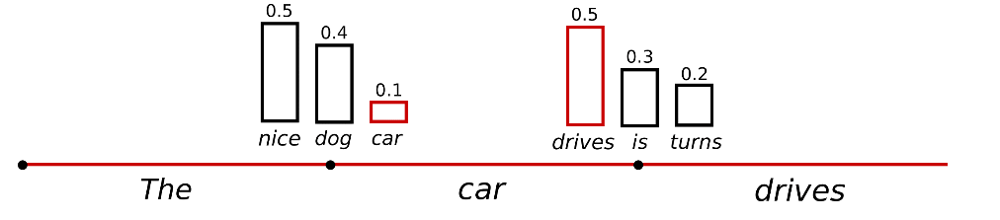
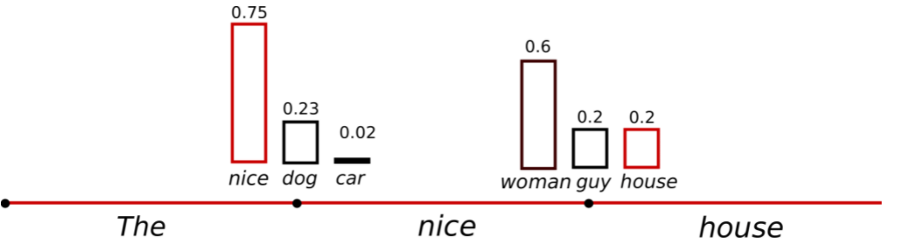
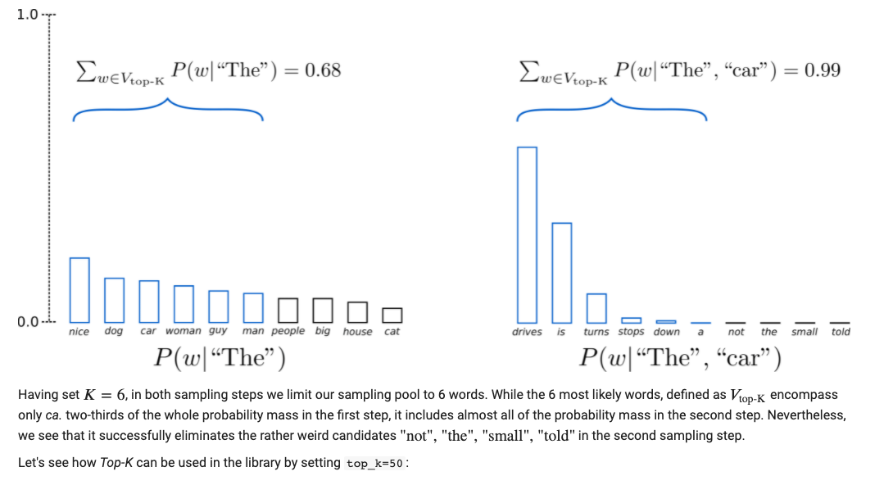
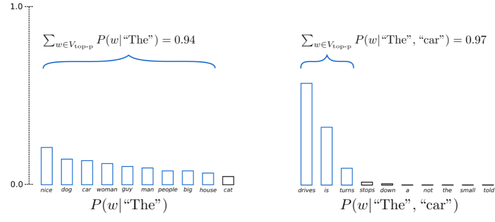

## 介绍

在自然语言处理中的生成任务中，通常会使用encoding-decoding 结构。针对于decoding技术有不同的方法。主要是以下三种: **greedy search** , **beam search**, **sampling**。写这篇文章主要出于两个目的：

1. 了解decoding 中的方法，便于后续工作中可以较为熟悉的掌握如何生成一个高质量的句子。
2. 如何修改源码使得通过生成句子的概率来实现bart模型的fintune.

## 方法

### greedy search

贪心检索算法非常简单，就是选择下一个词中最大概率的作为生成词: 

$w_t = argmax_w P(w|w_{1:t-1})$ 



从图中例子我们可以看到，最大的概率是“the nice woman”, 句子的概率是$0.5 * 0.4 = 0.2$。不过贪心检索算法有一个缺点，最高概率的句子可能被隐藏了。比如，“the dog has” 的概率是$0.4\times 0.9 = 0.36$ 。

### beam search

光束检索在一定程度上会避免贪心检索中高概率句子隐藏的问题。在每次生成时，会有一个num_beams的控制。比如，在上面的例子中，对于time step 1, 除了“the”,"nice","woman"。 Beam search 也会找到第二可能的“The”,"dog"。在time step 2，beam search 会发现 "The","dog","has" 有0.36，

```python
# activate beam search and early_stopping
beam_output = model.generate(
    input_ids,  
    max_length=50, 
    num_beams=5, 
    early_stopping=True
)

print("Output:\n" + 100 * '-')
print(tokenizer.decode(beam_output[0], skip_special_tokens=True))

Output:
----------------------------------------------------------------------------------------------------
I enjoy walking with my cute dog, but I'm not sure if I'll ever be able to walk with him again.

I'm not sure if I'll ever be able to walk with him again. I'm not sure if I'll
```

上面的例子中会有重复的句子，为了缓解这种情况，我们使用了2-gram penalty.


```python
# set return_num_sequences > 1
beam_outputs = model.generate(
    input_ids, 
    max_length=50, 
    num_beams=5, 
    no_repeat_ngram_size=2, 
    num_return_sequences=5, 
    early_stopping=True
)

# now we have 3 output sequences
print("Output:\n" + 100 * '-')
for i, beam_output in enumerate(beam_outputs):
  print("{}: {}".format(i, tokenizer.decode(beam_output, skip_special_tokens=True)))
  
  Output:
----------------------------------------------------------------------------------------------------
0: I enjoy walking with my cute dog, but I'm not sure if I'll ever be able to walk with him again.

I've been thinking about this for a while now, and I think it's time for me to take a break
1: I enjoy walking with my cute dog, but I'm not sure if I'll ever be able to walk with him again.

I've been thinking about this for a while now, and I think it's time for me to get back to
2: I enjoy walking with my cute dog, but I'm not sure if I'll ever be able to walk with her again.

I've been thinking about this for a while now, and I think it's time for me to take a break
3: I enjoy walking with my cute dog, but I'm not sure if I'll ever be able to walk with her again.

I've been thinking about this for a while now, and I think it's time for me to get back to
4: I enjoy walking with my cute dog, but I'm not sure if I'll ever be able to walk with him again.

I've been thinking about this for a while now, and I think it's time for me to take a step
```

Beam search 的弊端：

从上面的例子中可以看出，beam search生成的句子几乎都是一样的。对于一些开放式的生成任务，beam search 也许不是最好的选择。这主要是有一下几点：

- Beam search 可以在一些长度比较确定的生成任务会有笔记好的表现。比如机器翻译和摘要生成。但是对于开放式的生成任务，输出的句子长度就会变化很大，beam search就没有优势了。比如对话任务，故事生成任务。
- Beam search还会有重复句子的问题，虽然n-gram 可以在一定程度上对此作出惩罚，但是想调试出这个参数来会耗费大量的时间。
- 对我们人类而言，我们希望生成的句子不要那么死板。

### Sampling

随机选的思想就会比较简单，我们会根据下一个词的条件概率进行随机挑选:

$w_t\sim P(w|w_{1:t-1})$



```python
# set seed to reproduce results. Feel free to change the seed though to get different results
tf.random.set_seed(0)

# activate sampling and deactivate top_k by setting top_k sampling to 0
sample_output = model.generate(
    input_ids, 
    do_sample=True, 
    max_length=50, 
    top_k=0
)

print("Output:\n" + 100 * '-')
print(tokenizer.decode(sample_output[0], skip_special_tokens=True))

Output:
----------------------------------------------------------------------------------------------------
I enjoy walking with my cute dog. He just gave me a whole new hand sense."

But it seems that the dogs have learned a lot from teasing at the local batte harness once they take on the outside.

"I take
```

随机挑选的时候会出现一些比较奇怪的句子。这个是预料之中的。未来不让他生成的那么乱，我们可以让概率变的区分度高一点。也就是提高概率高的，打压概率低的。



```python
# set seed to reproduce results. Feel free to change the seed though to get different results
tf.random.set_seed(0)

# use temperature to decrease the sensitivity to low probability candidates
sample_output = model.generate(
    input_ids, 
    do_sample=True, 
    max_length=50, 
    top_k=0, 
    temperature=0.7
)

print("Output:\n" + 100 * '-')
print(tokenizer.decode(sample_output[0], skip_special_tokens=True))

Output:
----------------------------------------------------------------------------------------------------
I enjoy walking with my cute dog, but I don't like to be at home too much. I also find it a bit weird when I'm out shopping. I am always away from my house a lot, but I do have a few friends
```


### Top-k Sampling

Top-k sampling 可以帮助我们较好的解决这个问题。



```python
# set seed to reproduce results. Feel free to change the seed though to get different results
tf.random.set_seed(0)

# set top_k to 50
sample_output = model.generate(
    input_ids, 
    do_sample=True, 
    max_length=50, 
    top_k=50
)

print("Output:\n" + 100 * '-')
print(tokenizer.decode(sample_output[0], skip_special_tokens=True))

Output:
----------------------------------------------------------------------------------------------------
I enjoy walking with my cute dog. It's so good to have an environment where your dog is available to share with you and we'll be taking care of you.

We hope you'll find this story interesting!

I am from
```

可以看到这个结果就已经很不错了。不过这种方法也有一定的缺陷，将sample pool 限制到一个固定长度K 可能会是的模型生成一些胡言乱语的词。所以在此基础上还有一个top-p( nucleus) sampling。


### Top-p(nucleus) sampling



对于top-p方法，候选池的大小是由概率决定的。比如对于step 1， $p=0.92$, 我们会挑选概率之后$\ge0.92$的词集合，我们看到总共是9个，对于step 2, 概率是$\ge0.92$的只有3个。

```python
# set seed to reproduce results. Feel free to change the seed though to get different results
tf.random.set_seed(0)

# deactivate top_k sampling and sample only from 92% most likely words
sample_output = model.generate(
    input_ids, 
    do_sample=True, 
    max_length=50, 
    top_p=0.92, 
    top_k=0
)

print("Output:\n" + 100 * '-')
print(tokenizer.decode(sample_output[0], skip_special_tokens=True))

Output:
----------------------------------------------------------------------------------------------------
I enjoy walking with my cute dog. He will never be the same. I watch him play.


Guys, my dog needs a name. Especially if he is found with wings.


What was that? I had a lot of
```

top-k 和 top-p的方法可以进行使用。

```python
# set seed to reproduce results. Feel free to change the seed though to get different results
tf.random.set_seed(0)

# set top_k = 50 and set top_p = 0.95 and num_return_sequences = 3
sample_outputs = model.generate(
    input_ids,
    do_sample=True, 
    max_length=50, 
    top_k=50, 
    top_p=0.95, 
    num_return_sequences=3
)

print("Output:\n" + 100 * '-')
for i, sample_output in enumerate(sample_outputs):
  print("{}: {}".format(i, tokenizer.decode(sample_output, skip_special_tokens=True)))
  
  Output:
----------------------------------------------------------------------------------------------------
0: I enjoy walking with my cute dog. It's so good to have the chance to walk with a dog. But I have this problem with the dog and how he's always looking at us and always trying to make me see that I can do something
1: I enjoy walking with my cute dog, she loves taking trips to different places on the planet, even in the desert! The world isn't big enough for us to travel by the bus with our beloved pup, but that's where I find my love
2: I enjoy walking with my cute dog and playing with our kids," said David J. Smith, director of the Humane Society of the US.

"So as a result, I've got more work in my time," he said.
```

我们可以看到，这个效果是很好的。


## 修改源码

对于transformers而言，generation方法是no_grad 的，而我们想通过生成的概率对bart进行微调就必须把transformers中的代码给摘出来。最新版本的transformers封装的比较好，需要摘出来好多个文件。详情请见:

[https://github.com/shuishen112/bart-fintune.git](https://github.com/shuishen112/bart-fintune.git)