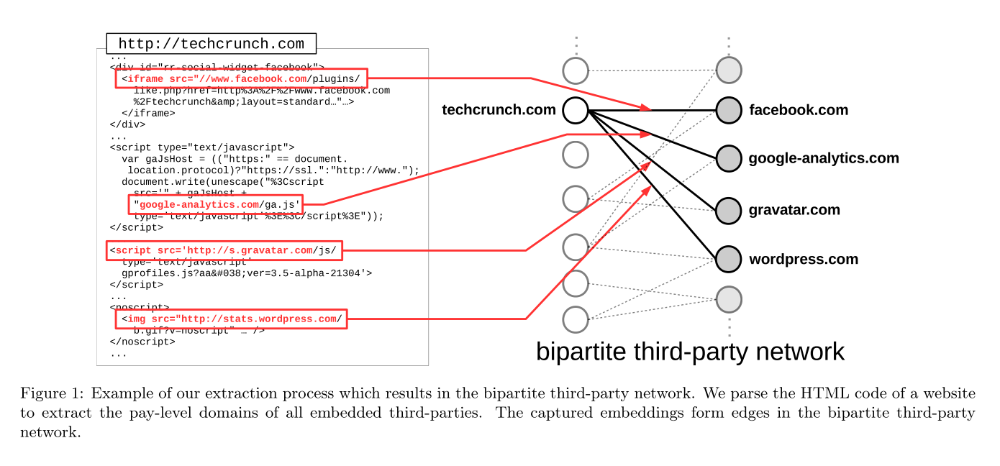
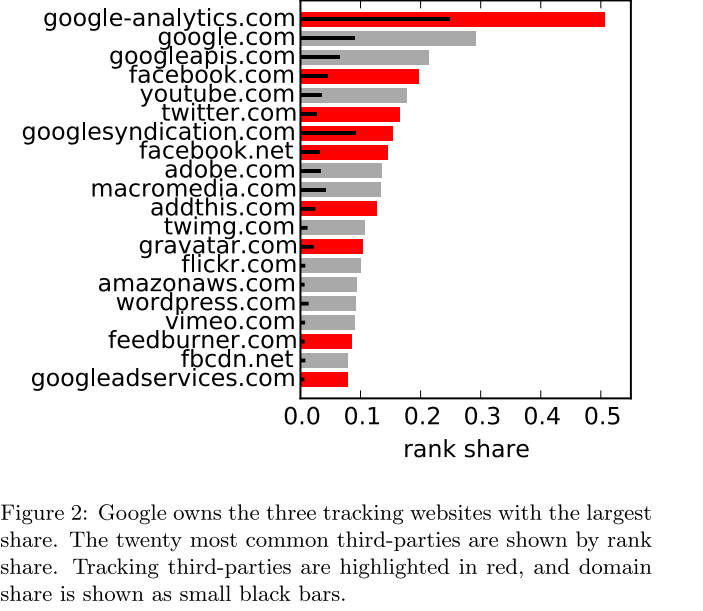
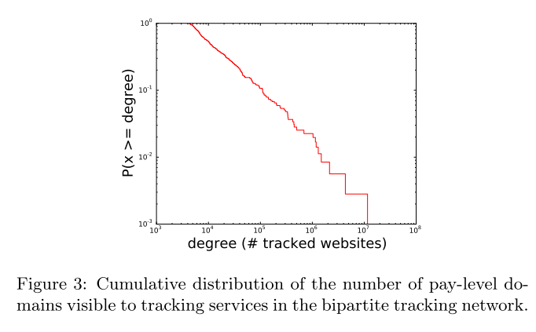
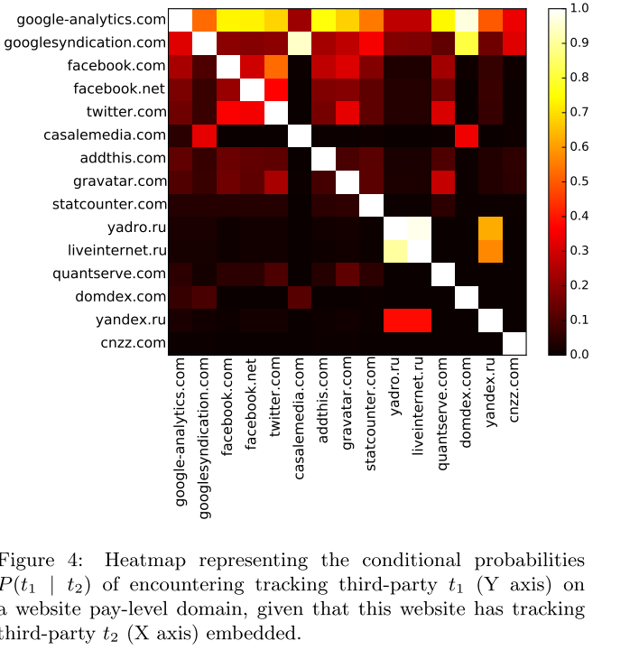
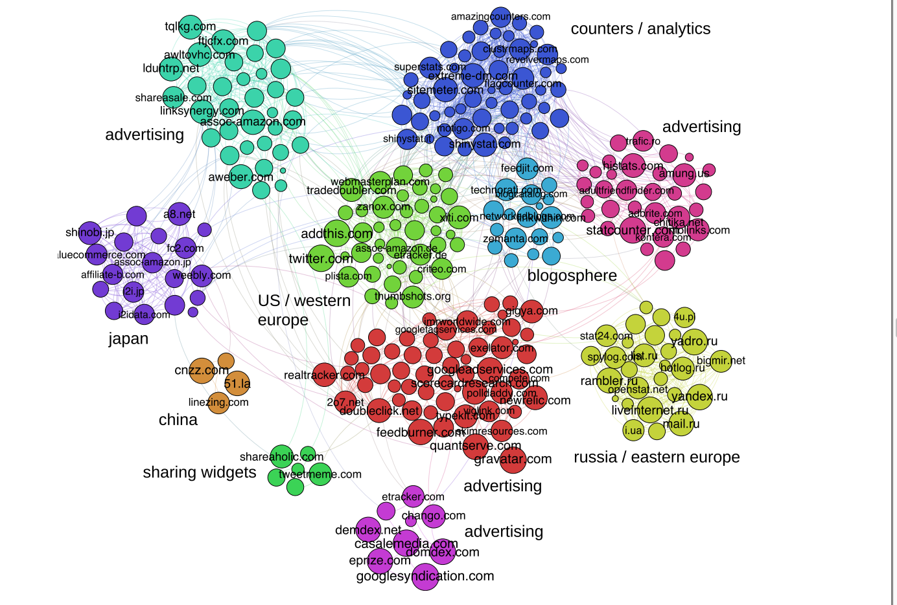

## 摘要

该论文对万维网中的third-party trackers 进行了分析, 从超过35亿的web page中抽取了third-party embedding。在多个维度上研究这个数据：

* 该工作leverage 大规模empirical web tracking 数据。数据包含了web的链接结构, 所以我们生成了ranking measure for tracker occurances based on aggregated network centrality rather than simple domain counts. 从后序的文章中可以看出，这个是bipartite third-party network.
* 在全球领域的角度出发，我们分析了tracking技术在全球领域的使用情况，比如trackers在各个网站的使用情况。
* 在国家层面， 我们分析了不同国家的trakcers使用情况。我们发现具有最高page rank的domain 都来自于Google。唯一的区别就是中国和俄罗斯，而这很可能和国家的政治因素有关。
* 我们还分析了是否网站的内容会影响trackers的选择。我们发现，具有个人隐私背景的网站会比其他的网站具有更少的trackers。

## 介绍

网站的功能之一就是去track 用户。近年来，另一个tracking机制已经被广泛使用，这就是嵌入在网站中的third-party websites。

事实上，网站的主要功能包含第三方内容。随着社交媒体和web2.0的发展，网站开始embeed links到第三方内容的内容中，这样可以允许网站的拥有者对用户进行web tracking。第三方内容可以通过网站track web users并且记录他们的浏览行为。因此，这些第三方的软件有一定的隐私危险。例如，收集健康条件的数据。新闻消费或者通过情报机构进行大规模的监视。为了理解和控制这些危害，深度理解“online tracking sphere”是非常有必要的。之前的研究工作已经学习了这个领域的一些方面。主要原因是这样一种大规模学习仅仅对于大公司来说才是可能的。而随着网络爬虫的发展，个人也可以研究大规模领域的online tracking。

我们处理了35亿web pages，抽取出bipartite "trackking graph", 其描述了41 million pay-level domains by 355 tracking service. pay-level domain(PLD) 是一个 public top level domain 的sub-domain。我们用这些数据来研究三个research questions。

1. 这些网站的predomainant tracking company 是什么。
2. 这些web trackers的分布是如何随着国家而变化的。由于不同政治，社会文化，经济因素，这些是如何变化的。
3. 在一些高度隐私的领域trackers的分布是如何变化的。

在这篇文章中，我们将我们之前的工作扩展到多个方向：

1. 我们在一个long tail of domains上进行了分析，大概有41 million pay level domain.
2. 我们分析了tracking company的分布 in top-level domain(TLDs) of no-English speaking countries. a small set of US-based companies 具有统治地位。相关的研究表明这个地位和政治因素有关。
3. 我们uncover country-specific category-specific patterns in the relations between third-party trackers by clustering their co-occurrences.

## Onling Tracking 基础

这里有几个概念需要我们熟悉

1. **third-partie**: one or more services may be present that record user's browsing to the website. Third-parties are either embedded dynamically such as via JavaScript or the iframe element, or statically via a link or image tags.
2. **trackers** 我们将third-parties 作为trackers 如果他们的主要目的或者他们拥有者公司的主要模式是为了收集用户信息。所以我们将advertising services 和 social network plugins 作为trackers，他们主要是依赖用户数据。另一方面，我们不会将content delivery networks 作为trackers, 因为他们的主要目的是加速网站。

## Data Acquisition

### Collection Methodology and Limitations

我们用pay-level domains 作为websites 和 third -party。在外面的抽取过程中，我们的抽取将HTML 文档作为输入，对HTML文档进行解析，trakcers来自于"script","iframe","link"和"image", 如图

这里注意一点，我们这种抽取方式不能完全意义上模拟用户, 对于一些实时对trackers不包含在内。

### Dataset Statistics and Characterstics

我们的数据包含3,536,611,510 web pages。然后，我们将这些网页做成bipartite third-party network. 这个网落结构表示12,756,244 third-parties 在41,192,060 pay level domains.

然后，我们根据third-parties出现的比率，最终人工标注了1375个third-parties. 对这1375个third-party进一步分析，明确他们的注册国家和注册公司。接下来我们根据他们的功能和商业模式对这些third-parties 进行归类，比如"content delivery", "analytics", "advertising" , "website builder", "image hosted"。 最终我们获得了355 个tracking services.

## Global analysis of Tracking Services

我们无法量化41 million pay-level domain 的访问量，因此我们对page rank进行了重排，在一定程度上，可以反映出网站的流量。我们计算page rank distribution 来获取ranking。接下来，我们使用这个分布来定义 third-party tracking 能力的的ranking measure。

### Ranking tracking Services

令D​ 表示要探索的domains 集合。t(D)​ 为一个子集{d|d \in D \wedge t}​ embeddied in d。\rho​表示page-rank value, p_{D,t}​叫做 rank shared

\rho\_{D,t} = \frac{\sum\_{i\in t(D)}p\_i}{\sum\_{i\in D}p_i} \tag{1}

在此基础上，我们还有domain shared

d_{D,t}=\frac{|t(D)|}{|D|}​

注意，这两个概念是不同的。

图中是我们统计出来的rank shared 和 domain shared.

显然，最常见的third-party 是 googleanalytics.com， 其rank share 是0.507. 其domain share 为0.248, 表明一共用24.8%的pay-level domains 有googleanalytics.com 的嵌入。我们发现有一半的third-parties 属于google。 接下来是social media-related third-parties 例如facebook.com, twitter.com 和 addthis.com. 接下来是一些content delivery services “twimg.com”, the cloud platform amazon Webservices( amazonaws.com) Facebook content delivery platform "fbcdn.net".

### Distribution of Large and Small Trackers

在这篇文章中的trackers变化是比较大的，少数trackers 在数百外的网站中使用，而有的仅仅在一些网站中使用。而trackers的分布情况是符合幂律分布的。

这种分布情况可以帮助我们解释一些现象。比如说，非常流行的trackers 会比小众的trackers更容易出现在新的网站中。图三九展示了对应的累积分布函数。我们发现50%的tracking services 嵌入在了少于1万个domain中。而在top 1% 的分布嵌入在了一百万pay-level domains中。

另一个我们想关注的问题是：Do sites using few (or many) trackers prefer big (or small) trackers? .

### Tracker Co-Occurences

现在我们关注tracker中的共现问题。比如，what proportion of hte website domains that embed facebook.com also embed twitter.com?

图4 表明前十五个最足有统治力的tracking services。

### Cluster Analysis of Tracker Co-Occurrences

接下来我们要分析country-specific 和 media-specific 的分析。首先，我们计算co-occurrences network of tracking services. 第二，我们cluster this network 使用Louvain 方法。

首先，我们可以得到一个邻接矩阵 A = B^{T}B , B是tracking network 的二阶邻接矩阵。B中的每一个元素都是从website 的PLD 到 tracking 的PLD。 而A_{ij}​​中的元素表示的是tracking 到tracking 的co-occurence 数量。我们使用了LLR 来对coccurrence matrix 进行剪枝。因此我们只保留了非常常见的tracker pairs。最后，我们将最终的network进行了聚类。我们对聚类的结果进行了进一步的处理，删除了一些非常小的clusters（只有两个节点），因此最终的co-occurrence network 只有329 个trackers，连接的边喂1857个边。

如图上图所示，我们对一些trackers的services和注册国家进行了标注，最终，我们发现有四个clusters是country-specific patterns